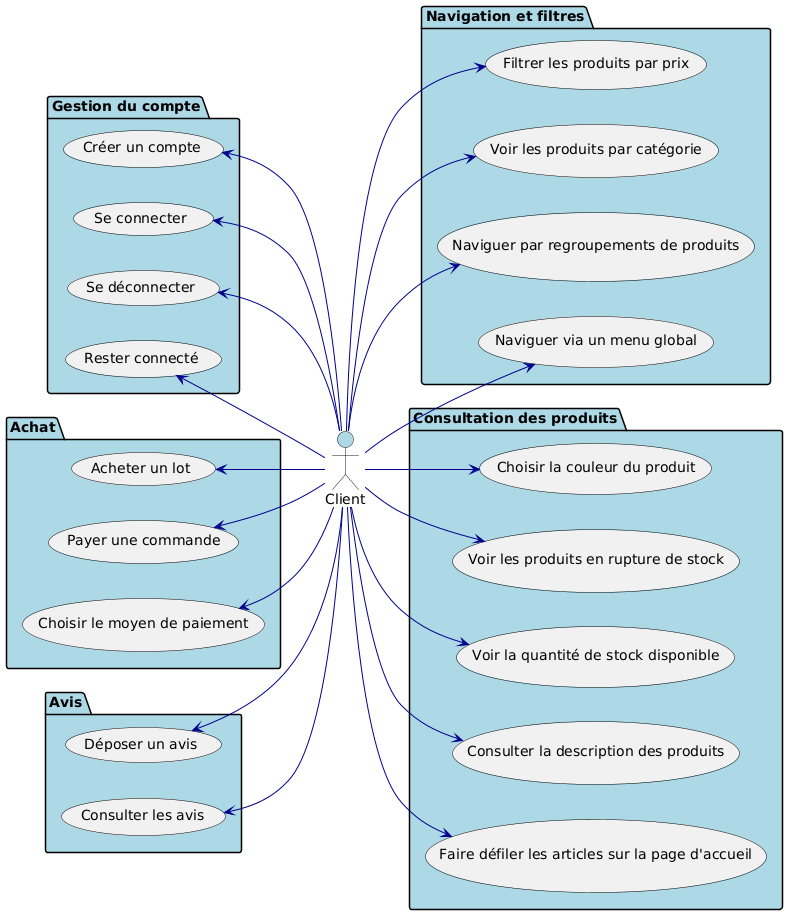
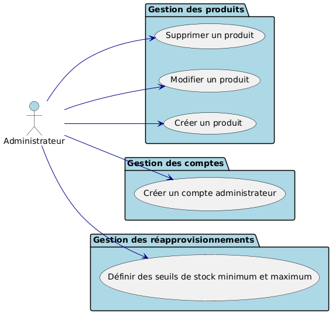
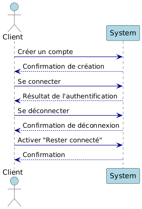
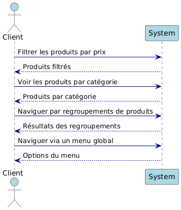
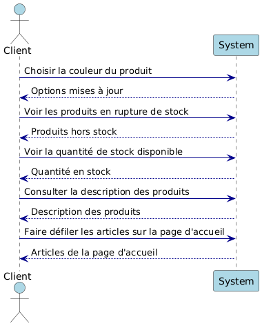
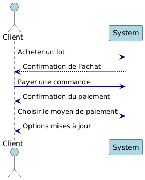
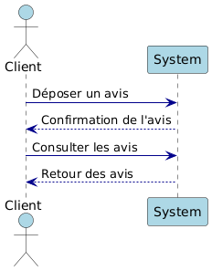
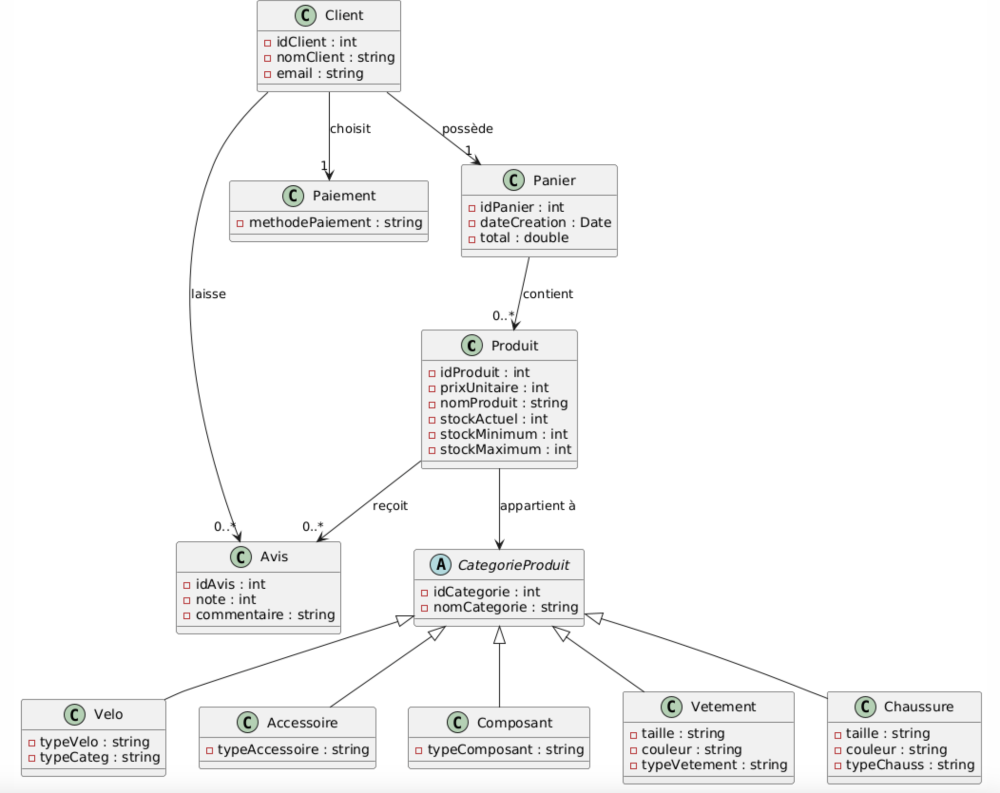
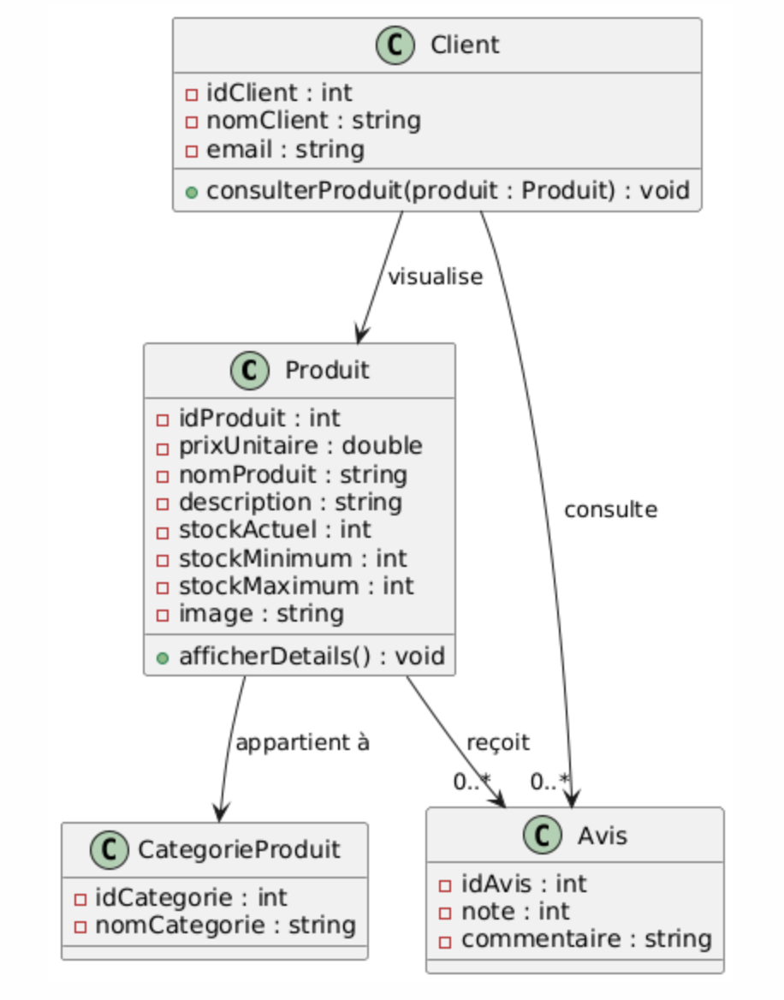
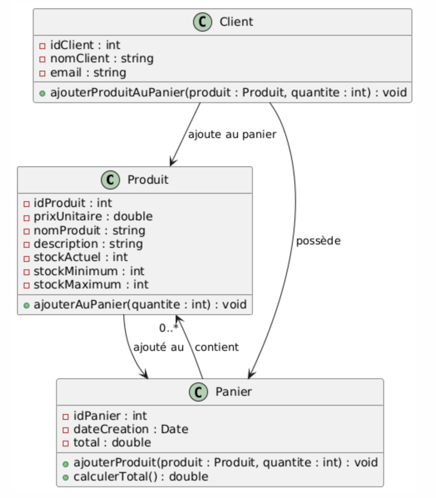

= Documentation de Conception
:toc:
:toc-title: Sommaire
:toclevels: 4

Entreprise : La Roue Tourne

Groupe 1B4 : 

- ABAYEV Amina
- GADBIN Hugo
- ARGUELLES Alexian
- DELAPLAGNE Titouan

== Introduction
[.text-justify]
Le projet "La Roue Tourne" vise à créer une plateforme de commerce en ligne dédiée aux produits liés au cyclisme, incluant des vélos, accessoires, composants, vêtements et chaussures. Ce site permettra aux utilisateurs de parcourir une large gamme de produits, d'ajouter des articles au panier et de finaliser leurs achats via des méthodes de paiement sécurisées. La présente documentation de conception détaille l'architecture du système, incluant les diagrammes de cas d’utilisation, de classe métier, ainsi que les spécifications techniques, afin de guider le développement du site.

== I. Diagrammes des cas d'utilisation

=== I.1. Cas d'utilisation Client

Le UseCase du client peut-être découpé en 4 catégories:

. Gestion du compte, 
les cas liés à la gestion du compte du client, permettant le passage et le suivi des commandes.
* Créer un compte
** `Enregistrer un nouveau compte utilisateur.`
* Se connecter
** `Accéder à son compte avec des identifiants.`
* Se déconnecter
** `Quitter son compte utilisateur.`
* Rester connecté
** `Maintenir la session utilisateur active.`

. Navigation et filtres,
les cas liés à la navigation sur le site et à l'amélioration de la qualité de recherche des articles.
* Filtrer les produits par prix
** `Trier les produits en fonction de leur prix.`
* Voir les produits par catégorie
** `Afficher les produits classés par catégories.`
* Naviguer par regroupements de produits
** `Parcourir les produits groupés par thèmes.`
* Naviguer via un menu global
** `Utiliser un menu principal pour naviguer sur le site.`

. Consultation des produits, 
les cas liés aux informations importantes sur chaque article.
* Choisir la couleur du produit
** `Sélectionner une couleur spécifique pour un produit.`
* Voir les produits en rupture de stock
** `Afficher les produits actuellement indisponibles.`
* Voir la quantité de stock disponible
** `Vérifier le nombre d'unités disponibles pour un produit.`
* Consulter la description des produits
** `Lire les détails et caractéristiques des produits.`
* Faire défiler les articles sur la page d'accueil
** `Parcourir les articles présentés sur la page principale.`

. Achat,
les cas liés à la gestion des achats, des offres et des paniers du client.
* Acheter un lot
** `Acquérir plusieurs unités d'un produit en une seule transaction.`
* Payer une commande
** `Régler le montant total de la commande.`
* Choisir le moyen de paiement
** `Sélectionner une méthode de paiement (carte, PayPal, etc.).`

. Avis,
les cas liés aux avis utilisateurs, permettant la communication entre clients et entre clients et vendeurs.
* Déposer un avis
** `Laisser un commentaire ou une évaluation sur un produit.`
* Consulter les avis
** `Lire les commentaires et évaluations laissés par d'autres utilisateurs.`

=== I.2. Cas d'utilisation administrateur

Le UseCase administrateur est lui découpé en trois section.

. Gestion des produits,
les cas liés à la gestion des produits sur le site.
* Supprimer un produit
** `Retirer un produit de la liste des articles disponibles.`
* Modifier un produit
** `Mettre à jour les informations d'un produit existant.`
* Créer un produit
** `Ajouter un nouveau produit à la liste des articles disponibles.`

. Gestion des comptes,
les cas liés à la gestion des comptes administrateurs.
* Créer un compte administrateur
** `Enregistrer un nouveau compte administrateur.`

. Gestion des réapprovisionnements,
les cas liés à la gestion des niveaux de stock.
* Définir des seuils de stock minimum et maximum
** `Établir les niveaux de stock minimum et maximum pour chaque produit.`

=== I.3. Diagramme séquence système

==== I.3.1. Gestion du compte

==== I.3.2. Navigation et filtres

==== I.3.3. Consultation des produits

==== I.3.4. Achat

==== I.3.5. Avis

== II.Diagramme de Classe Métier

=== II.1. Spécifique au client

[.text-justify]
Un Client possède un Panier qui peut contenir un ou plusieurs Produits. Chaque produit appartient à une CategorieProduit, qui peut être une catégorie spécifique telle que Velo, Accessoire, Composant, Vetement ou Chaussure. Le client peut également laisser des Avis sur les produits qu'il a achetés et effectuer un Paiement pour ses commandes.

=== II.2. Spécifique à l'administrateur
image::../image/diagClassClient.png[Diagramme de classes métier administrateur du site La Roue Tourne, width=700, height=500]

[.text-justify]
L'administrateur peut se connecter pour accéder aux fonctionnalités du site. Il peut ensuite gérer les produits, gérer les catégories, et gérer les utilisateurs. L'administrateur a également la possibilité de consulter les avis laissés par les clients et de visualiser les commandes. Ce diagramme met en évidence les tâches essentielles que l'administrateur peut réaliser pour gérer efficacement le site.

== III. Diagrammes de Classes de Conception

=== III.1. Recherche d’un produit
image::../image/recherchee.png[D, width=500, height=550]

[.text-justify]
Un utilisateur peut initier une recherche via la classe Recherche, qui prend en entrée des mots-clés et retourne une liste de Produits correspondants. Chaque Produit peut appartenir à une CategorieProduit spécifique (comme Vélos, Accessoires, etc.), et peut aussi recevoir plusieurs Avis de la part des clients. La recherche peut être filtrée par catégorie de produit, permettant ainsi une recherche plus ciblée. Ce diagramme illustre les interactions entre les classes et montre comment un client peut rechercher, filtrer, et consulter les produits disponibles sur le site.

=== III.2. Visualisation d’un produit

[.text-justify]
Lorsqu'un Client consulte un produit, il peut voir des informations détaillées sur le produit telles que sa description, son prix, son stock, et son image via la méthode afficherDetails(). Le client peut également consulter les Avis laissés par d'autres clients sur ce produit. Ce diagramme met en évidence les interactions essentielles pour permettre à un client d'explorer les détails d'un produit et de prendre une décision d'achat éclairée.

=== III.3. Ajout au panier

[.text-justify]
Lorsqu'un Client choisit un Produit, il peut l'ajouter au Panier en spécifiant la quantité souhaitée. Le panier calcule le total en fonction des produits et des quantités. La méthode ajouterAuPanier() dans la classe Produit et la méthode ajouterProduit() dans la classe Panier permettent d'effectuer cette action. Ce diagramme met en évidence les interactions nécessaires pour gérer l'ajout d'articles au panier et le calcul du total des achats.

== Conclusion

[.text-justify]
En conclusion, les diagrammes présentés dans cette documentation offrent une vue d'ensemble complète de la structure et des interactions du site e-commerce "La Roue Tourne". Les diagrammes de classes métier permettent de modéliser les entités principales du système, telles que les produits, les catégories, les avis, et les clients, en identifiant leurs attributs et leurs relations. Les diagrammes de classe de conception viennent compléter cette modélisation en détaillant les comportements spécifiques associés à des actions comme la recherche d'un produit, la visualisation des détails d'un produit et l'ajout au panier. Enfin, les cas d'utilisation définissent les principales interactions des utilisateurs, qu'il s'agisse du client ou de l'administrateur, en précisant les actions possibles et les objectifs de chaque rôle.
