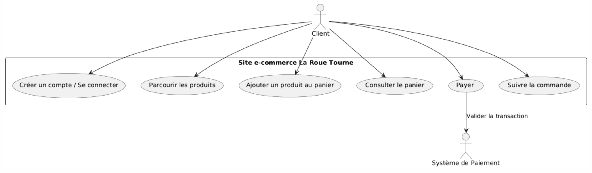
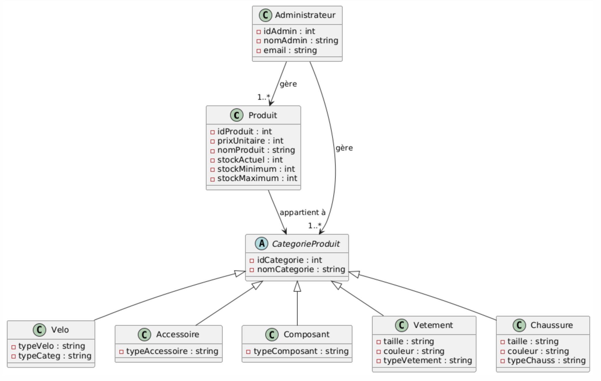

= Documentation de Conception
== La Roue Tourne
:toc:
:toc-title: Sommaire

Entreprise : La Roue Tourne

Groupe 1B4 : 

- ABAYEV Amina
- GADBIN Hugo
- ARGUELLES Alexian
- DELAPLAGNE Titouan

== Introduction
[.text-justify]
Le projet "La Roue Tourne" vise à créer une plateforme de commerce en ligne dédiée aux produits liés au cyclisme, incluant des vélos, accessoires, composants, vêtements et chaussures. Ce site permettra aux utilisateurs de parcourir une large gamme de produits, d'ajouter des articles au panier et de finaliser leurs achats via des méthodes de paiement sécurisées. La présente documentation de conception détaille l'architecture du système, incluant les diagrammes de cas d’utilisation, de classe métier, ainsi que les spécifications techniques, afin de guider le développement du site.

== I. Diagramme des cas d'utilisation

=== 1. Cas d'utilisation Client

[.text-justify]
Le Client peut créer un compte ou se connecter, parcourir les produits, ajouter des articles au panier, consulter son panier, payer sa commande, et suivre l'état de celle-ci. Lors de l’étape de paiement, une interaction est établie avec un système externe, le Système de Paiement, pour valider la transaction. Ce diagramme met en évidence les interactions entre l’utilisateur (Client) et le système, ainsi que le rôle d’un acteur externe pour la gestion des paiements. Il fournit une vue d'ensemble des fonctionnalités essentielles du site, ce qui facilite la compréhension du parcours utilisateur et des interactions principales avec le système.

=== 2. Cas d'utilisation administrateur
image::../image/useAdm.png[Diagramme de classes métier client du site La Roue Tourne, width=950, height=250]

[.text-justify]
L'administrateur peut se connecter au site, gérer les produits, les catégories, et les utilisateurs, consulter les avis laissés par les clients, ainsi que visualiser les commandes en cours. Il est ainsi en charge de la gestion globale du site, des articles, et de l'interaction avec les utilisateurs. Ce diagramme met en évidence les différentes fonctions essentielles offertes à l'administrateur pour maintenir et superviser le bon fonctionnement du site. Il illustre également les relations directes entre l’administrateur et les diverses opérations administratives, offrant ainsi une vue d'ensemble claire des tâches clés qu'il peut effectuer pour assurer la gestion efficace du site e-commerce.

== II.Diagramme de Classe Métier

=== 1. Spécifique au client
image::../image/DiagclassADm.png[Diagramme de classes métier client du site La Roue Tourne, width=700, height=500]

[.text-justify]
Un Client possède un Panier qui peut contenir un ou plusieurs Produits. Chaque produit appartient à une CategorieProduit, qui peut être une catégorie spécifique telle que Velo, Accessoire, Composant, Vetement ou Chaussure. Le client peut également laisser des Avis sur les produits qu'il a achetés et effectuer un Paiement pour ses commandes.

=== 2. Spécifique à l'administrateur

[.text-justify]
L'administrateur peut se connecter pour accéder aux fonctionnalités du site. Il peut ensuite gérer les produits, gérer les catégories, et gérer les utilisateurs. L'administrateur a également la possibilité de consulter les avis laissés par les clients et de visualiser les commandes. Ce diagramme met en évidence les tâches essentielles que l'administrateur peut réaliser pour gérer efficacement le site.

== III. Diagrammes de Classes de Conception

=== 1. Recherche d’un produit

=== 2. Visualisation d’un produit

=== 3. Ajout au panier

== IV.Spécifications Techniques

== Conclusion
